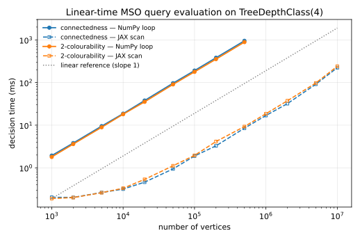

# AutStr

[](https://pypi.org/project/autstr/)
[](https://pypi.org/project/autstr/)
[](LICENSE)
[](https://numpy.org)
[](https://github.com/jax-ml/jax)
[](https://networkx.org)
[](https://www.nltk.org)

**Compute with infinite structures in Python — one formalism, many roles.**

AutStr represents infinite mathematical structures — the integers, the rationals
ℤ[1/p], whole classes of finite graphs and groups — as *finite automata*, and
lets you query them with first-order and monadic second-order logic. Because the
representation is exact and the logic is decidable, a single small framework acts
as several tools at once:

- 🧮 **a computer algebra system** for infinite domains — manipulate infinite
  sets and relations (ℤ, ℤ[1/p], …) with exact algebra, not floating point;
- ⊢ **a decision procedure / theorem prover** — decide first-order and MSO
  statements over infinite structures (Presburger and Büchi arithmetic, MSO over
  graphs), returning a proof-carrying yes/no;
- 🔬 **a (finite) algebra & model-theory system** — decide a property across an
  *entire family* of finite structures (all finite abelian groups, all graphs of
  bounded tree-depth) with one compiled automaton;
- ⚙️ **an algorithm synthesizer** — turn a logical *specification* into a
  **provably linear-time algorithm**. Problems that are NP-hard on general inputs
  become linear-time decisions on structurally restricted ones, running at tens
  of millions of elements per second.

All four are the same underlying object — an *automatic presentation* — viewed
from different angles.

---

## Quick start

```bash
pip install autstr
```

The friendliest entry point is the arithmetic package, which presents the
integers ℤ with addition, order, and base-2 weak divisibility.

```python
from autstr.arithmetic import VariableETerm as Var

x, y = Var('x'), Var('y')

# A relation is defined by comparing linear terms. This is the *infinite* set
# of all integer pairs (x, y) with x + y + 3 < 2x:
R = (x + y + 3).lt(2 * x)

R.isempty()      # False   — is the relation empty?
R.isfinite()     # False   — does it have finitely many solutions?
(0, 4) in R      # False   — membership test

for solution, _ in zip(R, range(5)):   # enumerate solutions, smallest-first
    print(solution)                     # (1, -3), (2, -2), (2, -3), ...
```

Every relation is a first-class, exactly-represented infinite object you can
combine with **relational algebra**:

```python
z = Var('z')
E = (x + y).eq(z)                 # the ternary relation  x + y = z
band = E & z.gt(0) & z.lt(3)      # intersect with  0 < z < 3
proj = band.drop(['z'])           # project away z  (an existential quantifier)
complement = ~proj                # negation
inf = E.exinf('x')                # { (y,z) | infinitely many x with x+y=z }
```

and a base-2 **weak divisibility** predicate that makes definitions like the
powers of two a one-liner:

```python
powers_of_two = x | x       # { 2^n : n >= 0 }
(1024,) in powers_of_two    # True
(3,) in powers_of_two       # False
```

---

## ⚙️ Highlight: synthesizing linear-time algorithms

Write *what* you want as a logical formula; AutStr compiles it — once — into a
finite automaton that decides it. On structurally restricted inputs (bounded
tree-depth, bounded pathwidth, …) that automaton is a **linear-time algorithm**,
even for properties that are NP-hard in general.

The [`autstr.graphs`](autstr/graphs.py) package presents *all graphs of tree-depth
≤ d* as one **uniformly automatic class** (see below). A graph is encoded as an
*advice word*; deciding an MSO property means running that word through the query
automaton — a single linear pass.

```python
import networkx as nx
from autstr.graphs import TreeDepthClass, TreeDepthGraph

cls = TreeDepthClass(3)

# Bipartiteness, as a monadic second-order formula. Compiled ONCE for the whole
# class into a 6-state automaton:
bipartite, _ = cls.evaluate(
    'exists c.(all x.(all y.((not E(x,y)) or '
    '((Subset(x,c) and (not Subset(y,c))) or '
    '((not Subset(x,c)) and Subset(y,c))))))')

triangle = TreeDepthGraph.from_networkx(nx.cycle_graph(3))
bipartite.accepts([(s,) for s in cls.advice(triangle)])   # False — in microseconds
```

**This scales.** Deciding the property on a graph is linear in its size, and the
work batches beautifully (optionally on a GPU via the JAX backend). Measured on a
laptop CPU (full details and reproduction in [`benchmarks/`](benchmarks/)):



- **Perfectly linear** decision time — a through-the-origin fit of R² = 1.0000
  across three orders of magnitude; the JAX backend decides a million-vertex graph
  in ~20 ms per query.
- **Batched evaluation** classifies tens of thousands of graphs at once at
  **~90 million vertices / second** — about **190×** a naive per-graph loop.
- **3-colourability** — NP-complete in general — becomes a linear-time decision
  here (its automaton is a heavier one-time compile; see the benchmark notes).

The benchmark suite covers four different classes — tree-depth and pathwidth
graphs, finite abelian groups, and extraspecial p-groups — each showing the same
linear scaling. This is the practical payoff of the theory: **a declarative
specification becomes an optimal streaming algorithm.**

### Programming with infinite sets

The flip side of algorithm *synthesis* is algorithm *design*: because relations
are first-class infinite objects, you can write algorithms that manipulate them
directly. Here is the Sieve of Eratosthenes running over the **actual infinite
set** of integers — no bound, no array:

```python
def infinite_sieve(steps):
    candidates = x.gt(1)                          # the infinite set {2, 3, 4, ...}
    primes = []
    for _ in range(steps):
        for (p,) in candidates:                   # candidates enumerate smallest-first
            primes.append(p); break               # ... so this is the next prime
        multiples = (x.eq(primes[-1] * Var('y'))).drop(['y'])
        candidates = candidates & ~multiples      # remove its multiples, symbolically
    return primes, candidates

primes, remaining = infinite_sieve(4)
# primes    == [2, 3, 5, 7]
# remaining  is the infinite set enumerating 11, 13, 17, 19, 23, 29, ...
```

Each `candidates & ~multiples` is an exact operation on infinite sets; nothing is
materialized until you iterate. It is a conceptual tool for reasoning about and
verifying infinite-state computations, not a fast primality test — but it shows
how naturally infinite structures become ordinary Python values.

---

## ⊢ Decision procedure & theorem prover

An [`AutomaticPresentation`](autstr/presentations.py) bundles automata for a
domain and its relations, and decides first-order statements about the presented
structure:

```python
from autstr.buildin.presentations import BuechiArithmeticZ

Z = BuechiArithmeticZ()          # (ℤ, +, <, |) as automata

Z.check('all x.(exists y.(A(x,y,x)))')          # ∀x ∃y: x+y=x   — True
Z.check('exists x.(all y.(Lt(x,y)))')           # a least integer? — False
```

Because the first-order theory of an automatic structure is decidable, `check`
always terminates with a definite answer — a theorem prover for the fragment of
mathematics these structures capture. `evaluate` goes further and returns the
automaton of *all* satisfying assignments, which you can enumerate or reuse.

---

## 🧮 Computer algebra over infinite domains

Structures need not be finitely generated. The localizations **ℤ[1/p]** — the
rationals whose denominator is a power of p — are infinite, non-finitely-generated
groups, yet each has an exact automatic presentation:

```python
from autstr.algebra import z1p_localization

z2 = z1p_localization(2)                       # (ℤ[1/2], +)

x = z2.from_fraction(1, 2)
y = z2.from_fraction(3, 4)
z2.check('A(x,y,z)', x=x, y=y, z=z2.add(x, y))                    # 1/2 + 3/4 = 5/4 — True
z2.check('all x.(exists y.(A(y,y,x)))')                           # 2-divisible?    — True
z2.check('all x.(exists y.(exists w.(A(y,y,w) and A(w,y,x))))')   # 3-divisible?    — False
```

The first-order divisibility theory even *distinguishes* the localizations: every
element of ℤ[1/2] is 2-divisible but not 3-divisible, and vice versa for ℤ[1/3].

---

## 🔬 Uniformly automatic classes: one automaton for a whole family

The centrepiece of version 2. A **uniformly automatic class** presents not one
structure but an entire *family*, by giving every automaton one extra tape that
reads an **advice string** synchronously with the elements. Fixing the advice
instantiates one member; a query is compiled once for the class and then decides
any member by running its advice word through the resulting automaton.

`autstr.graphs`, `autstr.algebra`, and `autstr.groups` ship ready-made classes:

```python
# Finite abelian groups — advice is the cyclic decomposition
from autstr.groups import FiniteAbelianGroups
ab = FiniteAbelianGroups()
ab.check('A(x,y,z)', [2, 3], x=(1, 1), y=(1, 2), z=(0, 0))   # (1,1)+(1,2)=(0,0) in Z2⊕Z3

# Non-abelian groups — dihedral, quaternion, semidihedral, modular, ...
from autstr.groups import IndexTwoCyclicGroups
G = IndexTwoCyclicGroups()
G.check('M(x,y,z)', G.dicyclic(4), x=(0, 1), y=(1, 0), z=(1, 1))   # i·j = k in Q₈

# Extraspecial p-groups — nilpotency class 2, order p^(1+2n)
from autstr.groups import ExtraspecialGroups
H = ExtraspecialGroups(3)
H.check('Cen(x)', 2, x=(1, (0, 0), (0, 0)))                        # central element
```

Built-in classes include:

| package | classes | signature |
|---------|---------|-----------|
| `autstr.graphs`  | bounded **tree-depth**, bounded **pathwidth** | full MSO over vertex sets (`Sing`, `Subset`, `E`) |
| `autstr.algebra` | finite **Boolean algebras**, **ℤ[1/p]** | `Meet`/`Join`/`Compl`/`Leq`/`Atom`; `+` |
| `autstr.groups`  | finite **abelian** groups, **index-≤2 cyclic** groups (dihedral, quaternion, semidihedral, modular), **extraspecial** p-groups | `+`; multiplication `M` |
| `autstr.tree_graphs` | bounded **tree-width**, bounded **clique-width** | full MSO over vertex sets (`Sing`, `Subset`, `E`) |
| `autstr.tree_groups` | **tree-indexed extraspecial** p-groups | multiplication `M` |

The generic machinery in [`autstr.uniform`](autstr/uniform.py) turns *any*
advice-indexed family of automata into a class with relativized query evaluation,
sentence checking, member instantiation (`get_structure`), and a first-order
`define` for bootstrapping complex relations from primitives.

The same machinery runs over **trees** rather than words. Where an automatic
presentation encodes elements as strings and a word automaton reads them, a
*tree-automatic* presentation encodes them as finite trees read by a bottom-up
tree automaton — which is exactly the step from Büchi's theorem to Rabin's.
[`autstr.tree_uniform`](autstr/tree_uniform.py) hosts the classes whose advice
is naturally a tree: a tree decomposition (bounded tree-width) or a
k-expression (bounded clique-width), and Skolem arithmetic (ℕ, ·) in
[`autstr.buildin.tree_presentations`](autstr/buildin/tree_presentations.py),
where a number is the tree of its prime exponents.

The showcase notebooks in [`notebooks/`](notebooks/) walk through all of it;
[`tree_classes.ipynb`](notebooks/tree_classes.ipynb) is the tour of the
tree-automatic side.

---

## 🧩 Composing presentations

Automatic structures over a shared signature are closed under disjoint union and
direct products; uniformly automatic classes of **finite** structures are closed under union and under
taking all finite direct products of their members. `autstr.composition` builds
the new presentation for you.

```python
from autstr.composition import (
    class_union, direct_product_closure, blocks, tagged_advice,
)
from autstr.groups import ExtraspecialGroups, IndexTwoCyclicGroups
from autstr.uniform import UniformlyAutomaticClass

cyclic, extra = IndexTwoCyclicGroups(), ExtraspecialGroups(3)

def reduct(uniform):                     # the signature the two classes share
    return UniformlyAutomaticClass(
        {'U': uniform.class_automata['U'], 'M': uniform.class_automata['M']})

# Members of either family ...
both = class_union(reduct(cyclic.cls), reduct(extra.cls))
# ... and every finite direct product of them.
groups = direct_product_closure(both)

z4 = tagged_advice(cyclic.cyclic(4), '<l>')          # Z4, abelian
heis = tagged_advice(extra.advice(1), '<r>')         # extraspecial 3^(1+2)

abelian = 'all x.(all y.(all z.(M(x,y,z) -> M(y,x,z))))'
groups.check(abelian, blocks(z4, z4))       # True  — Z4 × Z4
groups.check(abelian, blocks(z4, heis))     # False — one nonabelian factor
```

| operation | on | construction |
|-----------|----|--------------|
| `disjoint_union(A, B)` | structures | tag each element with the side it came from |
| `direct_product(A, B, kind='sync')` | structures | `R_A(a,a') ∧ R_B(b,b')` |
| `direct_product(A, B, kind='async')` | structures | `(R_A(a,a') ∧ b=b') ∨ (R_B(b,b') ∧ a=a')` |
| `class_union(C, D)` | classes | tag the *advice*, so the advice languages are disjoint |
| `direct_product_closure(C)` | classes | advice `α₁\|…\|αₙ` presents `A_{α₁} × … × A_{αₙ}` |

Two of these are worth a word. The **direct product** encodes a pair over the
*pair alphabet*, where a letter carries one letter of each factor; each factor
is then embedded by a variable renaming into its half of the bits, and the two
products are Boolean combinations of the embeddings. That is affordable only
because the pair alphabet has `|Σ_A|·|Σ_B|` letters but `bits_A + bits_B`
variables — **letters multiply, bits add**, which is precisely what the decision
diagrams buy.

The **product closure** concatenates advices with a separator. Since an element
of a finite member is never longer than its advice, the blocks line up across
every tape, so a relation of the product is the original relation holding in
every block — one automaton with **one extra state**, where an interleaved
encoding would need one copy per component. `FiniteAbelianGroups` is this
construction applied to the cyclic groups, and it predates the module.

[`notebooks/composition.ipynb`](notebooks/composition.ipynb) walks through all
five operations.

---

## How it works

An **automatic presentation** encodes a countable structure so that its domain is
a regular language and each relation is recognized by a synchronous multi-tape
automaton reading its arguments letter-by-letter in lockstep. The foundational
fact is that this recognizability is *closed under first-order definability*:
Boolean combinations correspond to product automata, and quantifiers to
projection followed by determinization. Consequently the first-order theory of
any automatic structure is **decidable**, and every definable relation is again
automatic — which is exactly what makes the "algebra of infinite relations" above
compute.

**Advice and uniform classes.** Allowing the automata to read an additional
fixed *advice* word widens the reach to structures like (ℚ, +) and, using a *set*
of advices, to whole parameterized classes of finite structures. Deciding the
first-order theory of a uniformly automatic class reduces to the monadic
second-order theory of its advice language (Abu Zaid–Grädel–Reinhardt 2017;
Abu Zaid 2018).

**Trees.** The same programme runs over finite *trees* read by bottom-up tree
automata rather than words read by word automata — the step from Büchi's theorem
to Rabin's. A tree-automatic presentation buys structures that no string encoding
reaches naturally, such as (ℕ, ·) with a number written as the tree of its prime
exponents, and classes whose advice is inherently a tree: a tree decomposition
(bounded tree-width) or a k-expression (bounded clique-width).

**Why it is fast — and where it is hard.** Evaluating a *fixed* formula on a
structure is one linear pass of its advice through the query automaton, so on any
class of bounded width every fixed MSO property is decided in linear time — a
constructive, streaming form of Courcelle's theorem. The cost lives entirely in
*compiling* the automaton.

A transition is not a `symbol -> target` table but a **decision diagram over the
symbol's digits**, hash-consed and shared across states and automata
([`autstr.mtbdd`](autstr/mtbdd.py)) — the representation MONA uses, for the same
reason. A transition that ignores a tape never tests that tape's variables, so
cylindrification is a variable renaming rather than a duplication of every row
once per letter of every new tape, complementation touches no diagram at all, and
the alphabet's *width* stops driving the cost. What remains is the subset
explosion of determinizing an existential quantifier: element quantifiers are
cheap, and *set* quantifiers (MSO proper) determinize over subsets of the
intermediate automaton's states. Connectedness and bipartiteness compile in
seconds; 3-colourability — the minimal NP-hard MSO query — is a genuinely large
one-time compile. Once compiled, an automaton can be serialized (diagrams and
all) and reused forever.

Around the diagrams the engine is batched NumPy: frontier-batched constructions,
hashed partition refinement, and a subset construction that runs in a collectable
scratch store. JAX is an optional accelerator used only for bulk word processing.

---

## Installation

```bash
pip install autstr              # NumPy-only core — installs anywhere
pip install autstr[jax]         # + JAX-accelerated batch word processing
pip install autstr[graphs]      # + networkx conversion for the graph classes
pip install autstr[benchmarks]  # + matplotlib for the benchmark plots
```

```bash
python -c "from autstr import __version__; print(f'AutStr v{__version__}')"
```

Requires Python 3.10–3.14. The core depends only on NumPy, nltk, and graphviz.

---

## Changelog & an experiment in AI-assisted algorithm engineering

AutStr began in 2022 as a summer project — a hands-on realization of the automatic
structures its author had studied during his PhD in algorithmic model theory.
Since then, each major release has doubled as a **snapshot of what a frontier AI
coding system can do on hard, verifiable algorithmic work**, with the
mathematical direction and review kept firmly human.

- **v1.0 (2022) — human.** The original library and arithmetic front-end.
- **v1.x (July 2025) — DeepSeek.** A vibe-coding session (with extensive human
  testing and supervision) that added the sparse-DFA backend, serialization, and
  the MSO0 finite-powerset structure, and modernized packaging.
- **v2.0 (July 2026) — Claude, Anthropic's Fable 5 model.** An intensive two-day
  pair-programming session inside Claude Code that:
  - profiled and rewrote the entire automata core as batched, sparsity-aware
    NumPy — a **10²–10³× speedup** (the reference query dropped from 85 s to
    0.03 s), with linear memory;
  - migrated the library from a hard JAX dependency to a NumPy-canonical core with
    JAX as an optional accelerator;
  - built the whole uniformly-automatic layer — the generic advice machinery,
    bounded tree-depth and pathwidth graphs with MSO, finite Boolean algebras,
    finite abelian groups, the ℤ[1/p] presentations, and the non-abelian group
    classes — each verified against exhaustive or exact ground-truth oracles;
  - added the [benchmark suite](benchmarks/) and these docs.

  The ideas realized in v2 include constructions the author had sketched a decade
  earlier; several went from a whiteboard description to running, tested code
  within hours. The code is the model's; the theory, the choices, and the
  verification protocol were human.

- **v3.0 (July 2026) — Claude, (various models)** A second session, in
  the same protocol, that took the library from strings to trees and replaced the
  transition representation underneath both:
  - **tree-automatic structures.** `autstr.sparse_tree_automata` (bottom-up tree
    automata), `autstr.tree_presentations`, and `autstr.tree_uniform` — the tree
    counterparts of the whole stack. New members: **Skolem arithmetic** (ℕ, ·),
    graphs of bounded **tree-width** and bounded **clique-width** with full MSO,
    and tree-indexed **extraspecial p-groups**. Cross-validated by embedding the
    string engine's Büchi arithmetic into the tree engine and re-deciding every
    sentence through both.
  - **transitions are shared multi-terminal BDDs** over the symbol's digits, in
    both engines. `expand` became a variable renaming, `complement` stopped
    touching diagrams at all, and `minimize` became one `apply` per state per
    round. Queries that had been impossible for lack of alphabet width now
    compile: an arity-5 relation over a 14-letter alphabet (14⁵ = 537 824 flat
    symbols) went from *infeasible* to 0.2 s; tree-depth-4 bipartiteness from
    17 s to 0.4 s. The test suite went from ~2 min to ~35 s.
 
  - **composing presentations.** `autstr.composition`: disjoint union and
    synchronous/asynchronous direct products of automatic structures, union of
    uniformly automatic classes, and the direct-product closure of a class.
    Composed, they present every finite direct product of index-≤2 cyclic groups
    and extraspecial p-groups, drawn from either family — and decide that such a
    product is abelian exactly when all of its factors are.

---

## References

1. **Abu Zaid, F.** *Algorithmic Solutions via Model Theoretic Interpretations.*
   Dissertation, RWTH Aachen University, 2016.
   DOI: [10.18154/RWTH-2017-07663](https://doi.org/10.18154/RWTH-2017-07663)

2. **Abu Zaid, F.** *Uniformly Automatic Classes of Finite Structures.*
   FSTTCS 2018, LIPIcs vol. 122, pp. 10:1–10:21.
   DOI: [10.4230/LIPIcs.FSTTCS.2018.10](https://doi.org/10.4230/LIPIcs.FSTTCS.2018.10)
   *The meta-theorems for finite Boolean algebras, finite groups, and graphs of
   bounded tree-depth implemented by `autstr.uniform`, `autstr.graphs`,
   `autstr.algebra`, and `autstr.groups`.*

3. **Abu Zaid, F., Grädel, E., & Reinhardt, F.** *Advice Automatic Structures and
   Uniformly Automatic Classes.* CSL 2017, LIPIcs vol. 82, pp. 35:1–35:20.
   DOI: [10.4230/LIPIcs.CSL.2017.35](https://doi.org/10.4230/LIPIcs.CSL.2017.35)
   *Introduces automatic presentations with advice — the foundation of the uniform
   classes here; the ℤ[1/p] presentation follows its blueprint for (ℚ, +).*

4. **Blumensath, A., & Grädel, E.** *Automatic Structures.* LICS 2000, pp. 51–62.
   [Proceedings](https://lics.siglog.org/2000/Grdel-AutomaticStructures.html)

5. **Khoussainov, B., & Nerode, A.** *Automatic presentations of structures.*
   LCC 1994, LNCS vol. 960, Springer.
   DOI: [10.1007/3-540-60178-3_93](https://doi.org/10.1007/3-540-60178-3_93)

6. **Khoussainov, B., Rubin, S., & Stephan, F.** *Automatic Structures: Richness
   and Limitations.* LMCS 3(2), 2007.
   arXiv: [cs/0703064](https://arxiv.org/abs/cs/0703064) ·
   DOI: [10.2168/LMCS-3(2:2)2007](https://doi.org/10.2168/LMCS-3%282%3A2%292007)

### Foundations

The idea that a logic can be decided by translating formulas into automata long
predates the term *automatic structure*; this library is a late implementation of
a line of work that runs through:

7. **Büchi, J. R.** *Weak Second-Order Arithmetic and Finite Automata.*
   Zeitschrift für math. Logik und Grundlagen der Mathematik 6 (1960), 66–92.
   DOI: [10.1002/malq.19600060105](https://doi.org/10.1002/malq.19600060105)
   *Monadic second-order logic over (ℕ, +1) is decidable, by translation into
   finite automata. Every `evaluate` call in this library is this construction.*

8. **Rabin, M. O.** *Decidability of Second-Order Theories and Automata on
   Infinite Trees.* Transactions of the AMS 141 (1969), 1–35.
   DOI: [10.2307/1995086](https://doi.org/10.2307/1995086)
   *The same programme over trees. `autstr.sparse_tree_automata` and the
   tree-automatic presentations are the finite-tree fragment of this.*

9. **Courcelle, B.** *The Monadic Second-Order Logic of Graphs I: Recognizable
   Sets of Finite Graphs.* Information and Computation 85(1), 1990, 12–75.
   DOI: [10.1016/0890-5401(90)90043-H](https://doi.org/10.1016/0890-5401%2890%2990043-H)
   *MSO properties of graphs of bounded tree-width are decidable in linear time.
   `autstr.tree_graphs.TreeWidthClass` builds the automaton the theorem promises.*

10. **Courcelle, B., & Olariu, S.** *Upper Bounds to the Clique Width of Graphs.*
    Discrete Applied Mathematics 101 (2000), 77–114.
    DOI: [10.1016/S0166-218X(99)00184-5](https://doi.org/10.1016/S0166-218X%2899%2900184-5)
    *The k-expressions that `autstr.tree_graphs.CliqueWidthClass` reads as advice.*

11. **Makowsky, J. A.** *Algorithmic Uses of the Feferman–Vaught Theorem.*
    Annals of Pure and Applied Logic 126 (2004), 159–213.
    DOI: [10.1016/j.apal.2003.11.002](https://doi.org/10.1016/j.apal.2003.11.002)
    *The composition method behind meta-theorems of this shape.*

### Related tools

- **[MONA](https://www.brics.dk/mona/)** (Klarlund, Møller, Henriksen et al.)
  decides WS1S and WS2S by translating formulas to automata whose transitions are
  shared multi-terminal BDDs over the symbol's bits. AutStr's
  [`autstr.mtbdd`](autstr/mtbdd.py) adopts exactly that representation, for
  exactly MONA's reason: over a convolution alphabet, the flat
  `symbol -> target` table is the bottleneck.
- **[Walnut](https://cs.uwaterloo.ca/~shallit/walnut.html)** (Mousavi, Shallit)
  proves theorems about automatic sequences by deciding first-order statements
  over (ℕ, +) with automata — the same decision procedure, aimed at combinatorics
  on words rather than at presenting structures.

Both are mature and fast, and neither targets *uniformly* automatic classes or
arbitrary automatic presentations, which is where AutStr sits.
