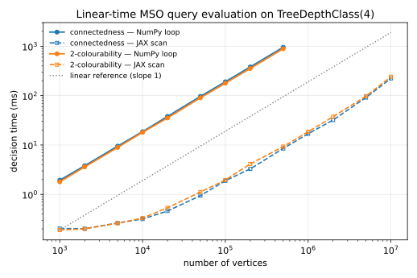

# AutStr

[](https://pypi.org/project/autstr/)
[](https://pypi.org/project/autstr/)
[](LICENSE)
[](https://numpy.org)
[](https://github.com/jax-ml/jax)
[](https://networkx.org)
[](https://www.nltk.org)

**Compute with infinite structures in Python — one formalism, many roles.**

AutStr represents infinite mathematical structures — the integers, the rationals
ℤ[1/p], whole classes of finite graphs and groups — as *finite automata*, and
lets you query them with first-order and monadic second-order logic. Because the
representation is exact and the logic is decidable, a single small framework acts
as several tools at once:

- 🧮 **a computer algebra system** for infinite domains — manipulate infinite
  sets and relations (ℤ, ℤ[1/p], …) with exact algebra, not floating point;
- ⊢ **a decision procedure / theorem prover** — decide first-order and MSO
  statements over infinite structures (Presburger and Büchi arithmetic, MSO over
  graphs), returning a proof-carrying yes/no;
- 🔬 **a (finite) algebra & model-theory system** — decide a property across an
  *entire family* of finite structures (all finite abelian groups, all graphs of
  bounded tree-depth) with one compiled automaton;
- ⚙️ **an algorithm synthesizer** — turn a logical *specification* into a
  **provably linear-time algorithm**. Problems that are NP-hard on general inputs
  become linear-time decisions on structurally restricted ones, running at tens
  of millions of elements per second.

All four are the same underlying object — an *automatic presentation* — viewed
from different angles.

> 📖 For a thorough introduction to the library, please consult the
> **[Documentation](https://fariedabuzaid.github.io/AutStr/)**.

---

## Quick start

```bash
pip install autstr
```

Ask any structure for its **symbolic interface** and it hands you variables that
compose with ordinary Python operators. Relations are first-class,
exactly-represented **infinite** objects.

```python
from autstr.arithmetic import BuechiArithmeticZ

Z = BuechiArithmeticZ().symbolic()         # (ℤ, +, <, |₂); no setup required
x, y, z = Z.vars('x y z')

R = (x + y + 3).lt(2 * x)     # the infinite set { (x, y) : x + y + 3 < 2x }
R.is_empty()                  # False
(0, 4) in R                   # False   — membership test

band = (x + y).eq(z) & z.gt(0) & z.lt(3)   # x + y = z  ∧  0 < z < 3
for s, _ in zip(band.drop(z), range(3)):   # ∃z, then enumerate smallest-first
    print(s)                               # (0, 1), (1, 0), (1, 1)
```

Nothing is materialized until you iterate; `& | ~` are exact operations on
infinite sets. Integers go in and come out because the structure ships a
**codec** along with its operators — and so does every other structure here, so
the same expressions work elsewhere unchanged:

```python
from autstr.powerset import MSO0

a, b, c = MSO0().symbolic().vars('a b c')  # finite sets of naturals
({0, 1}, {1, 2}, {0, 1, 2}) in (a + b).eq(c)      # union — True
```

Where a formula reads better as text, `check` and `evaluate` still take
strings; the two are interchangeable.

---

## Structures and classes

AutStr represents two kinds of thing, and the distinction shapes everything you
do with it.

### A structure — one infinite object

(ℤ, +, <), the rationals (ℚ, +) = ℤ[1/p], Skolem arithmetic (ℕ, ·). An
`AutomaticPresentation` bundles automata for a structure's domain and relations.
Because the first-order theory of an automatic structure is **decidable**,
`check` always terminates with a definite answer — a theorem prover for the
fragment these structures capture — and `evaluate` returns the automaton of *all*
satisfying assignments, which you can enumerate or reuse.

```python
from autstr.arithmetic import BuechiArithmeticZ

Z = BuechiArithmeticZ()                          # (ℤ, +, <, |) as automata
Z.check('all x.(exists y.(A(x,y,x)))')           # ∀x ∃y: x+y=x   — True
Z.check('exists x.(all y.(Lt(x,y)))')            # a least integer? — False
```

### A class — a whole family at once

A **uniformly automatic class** presents an entire *family* of finite structures
by giving every automaton one extra tape that reads an **advice string**
synchronously with the elements; fixing the advice instantiates one member. A
query is compiled **once for the class** and then decides *any* member by running
its advice word through the resulting automaton — a single linear pass.

On classes of bounded width this is a constructive, streaming form of
**Courcelle's theorem**: a declarative MSO specification becomes a **linear-time
algorithm**, even for properties that are NP-hard in general.

```python
import networkx as nx
from autstr.graphs import TreeDepthClass, TreeDepthGraph

cls = TreeDepthClass(3)                           # ALL graphs of tree-depth ≤ 3
bipartite = ('exists c.(all x.(all y.((not E(x,y)) or '   # MSO, compiled once
             '((Subset(x,c) and (not Subset(y,c))) or '
             '((not Subset(x,c)) and Subset(y,c))))))')

cls.check(bipartite, TreeDepthGraph.from_networkx(nx.cycle_graph(3)))  # triangle → False, in µs
cls.check(bipartite, TreeDepthGraph.from_networkx(nx.path_graph(6)))   # path → True
```

Deciding the property on a member is linear in its size and batches beautifully
(optionally on a GPU via the JAX backend) — measured, a through-the-origin
R² = 1.0000 across three orders of magnitude, ~90 million vertices / second in
batch:



---

## What's implemented

**Structures** — single automatic presentations:

| package | structures |
|---------|------------|
| `autstr.arithmetic`, `autstr.tree_arithmetic`, `autstr.powerset` | Presburger and Büchi arithmetic (ℤ and ℕ, +, <, \|₂), Skolem arithmetic (ℕ, ·) on the tree engine, the MSO0 finite-powerset structure |
| `autstr.algebra`, `autstr.tree_algebra` | the localizations **ℤ[1/p]**, finite **Boolean algebras**, and the countable **atomless Boolean algebra** |
| `autstr.infinite_graphs`, `autstr.ordinals`, `autstr.turing` | the **integer grid** ℤⁿ, the **regular tree** T_k, the **ordinals** below ω^ω and — on the tree engine — below ω^(ω^ω), **Turing-machine configuration graphs** |
| `autstr.collapsible`, `autstr.collapsible_reach` | **level 2 collapsible pushdown graphs** — tree-automatic by Kartzow's encoding, and the one automatic route to them, since their MSO theory is undecidable. **Reachability** is a relation of the graph, so first-order formulas may ask about runs of any length — the question a Turing machine's configuration graph cannot answer |

**Classes** — one automaton for a whole family, indexed by advice:

| package | classes | signature |
|---------|---------|-----------|
| `autstr.graphs`, `autstr.tree_graphs` | bounded **tree-depth**, **pathwidth**, **tree-width**, **clique-width**, **rank-width** graphs | full MSO over vertex sets (`Sing`, `Subset`, `E`) |
| `autstr.groups`, `autstr.tree_groups` | finite **abelian** groups, **index-≤2 cyclic** groups (dihedral, quaternion, semidihedral, modular), **extraspecial** p-groups, class-2 groups of bounded **rank-width** (over F_p or ℤ/pᵈ) | group multiplication `M` |
| `autstr.cocycle_groups` | **distributed-center** class-2 groups of bounded rank-width | multiplication `M` |

Four capabilities cut across all of these:

- **Composition** (`autstr.composition`) — disjoint union and direct products of
  structures, and union and finite-product closure of classes.
- **First-order interpretations** (`autstr.interpretations`) — automatic
  structures are closed under FO-interpretations, and `interpret` *computes* the
  interpreted presentation: a domain formula, a formula per relation, elements as
  k-tuples, optionally quotiented by a definable equivalence. It is how the
  ordinals are built — three formulas over Büchi arithmetic, no automaton
  authored. Quotients work over trees too, where no order is well-founded and
  the representative of a class is its least *description* (Kuske & Weidner).
- **Implicit evaluation** (`autstr.implicit`) — `check_implicit` /
  `evaluate_implicit` decide formulas and compute satisfying sets *without
  building a query automaton*, reaching members whose automata are far too large
  to construct.
- **Trees** (`autstr.tree_uniform`, `autstr.sparse_tree_automata`) — the same
  programme over finite trees read by bottom-up tree automata, the step from
  Büchi's theorem to Rabin's.

The executable notebooks in [`notebooks/`](notebooks/) work through all of it,
one per area — arithmetic & algebra, infinite structures, graphs, groups,
composition & interpretations, and implicit evaluation.

---

## Installation

```bash
pip install autstr              # NumPy-only core — installs anywhere
pip install autstr[jax]         # + JAX-accelerated batch word processing
pip install autstr[graphs]      # + networkx conversion for the graph classes
pip install autstr[benchmarks]  # + matplotlib for the benchmark plots
```

```bash
python -c "from autstr import __version__; print(f'AutStr v{__version__}')"
```

Requires Python 3.10–3.14. The core depends only on NumPy, nltk, and graphviz.

---

## An experiment in AI-assisted algorithm engineering

AutStr began in 2022 as a summer project — a hands-on realization of the automatic
structures its author had studied during his PhD in algorithmic model theory.
Since then, each major release has doubled as a **snapshot of what a frontier AI
coding system can do on hard, verifiable algorithmic work**, with the
mathematical direction and review kept firmly human.

<p align="center">
  
</p>

- **v1.0 (2022) — human.** The original library and arithmetic front end.
- **v1.x (2025) — DeepSeek.** A vibe-coding session, with extensive human
  testing and supervision.
- **v2.0–v3.1 (2026) — Claude.** The automata core rewritten as batched,
  sparsity-aware NumPy (10²–10³× faster); the uniformly-automatic layer; the
  step from strings to trees; MTBDD transitions; the rank-width families.
- **v4.0 (2026) — Claude.** This release.

Several of the constructions realized here were sketched by the author a decade
earlier and had never been implemented; some went from a whiteboard description
to running, tested code within hours. The code is the model's; the theory, the
choices, and the verification protocol are human.

### What is new in v4.0

- **A symbolic first-order layer.** Write `(x + y).eq(z) & z.lt(100)` instead of
  a formula string, over any structure or class, on either engine. Every
  structure declares its own operators and its own **codec**, so Python values
  go in and come out and `symbolic()` needs no arguments.
- **First-order interpretations** that *compute* the interpreted presentation,
  quotients included — over trees too, where the representative of a class is
  its least description rather than its least member.
- **Infinite graphs**: the integer grid, the regular tree, and Turing-machine
  configuration graphs, where first-order logic stops exactly at reachability.
- **Level 2 collapsible pushdown graphs, with reachability.** Tree-automatic by
  Kartzow's encoding, and `Reach` is a relation of the graph — so a first-order
  formula may ask about runs of any length, which is precisely what the Turing
  graph cannot be asked.
- **The countable atomless Boolean algebra**, and the ordinals below ω^ω and
  ω^(ω^n).
- **Serialization for the tree engine**, so an expensive relation is built once
  and kept.
- `autstr.buildin` is gone: every structure the library ships is built in, so
  its contents moved to modules named for their subject. See the changelog for
  the upgrade path.

📜 **[Full changelog](CHANGELOG.md)** — every release, in detail.

---

## References

AutStr implements a line of work that runs from Büchi's theorem to uniformly
automatic classes. The four below are the ones it leans on most; the
**[full bibliography](https://fariedabuzaid.github.io/AutStr/references.html)**
in the documentation lists the rest — Rabin, Courcelle, Delhommé, Kuske &
Weidner, Kartzow and others — and says for each what in the library it is.

1. **Büchi, J. R.** *Weak Second-Order Arithmetic and Finite Automata.*
   Zeitschrift für math. Logik und Grundlagen der Mathematik 6 (1960), 66–92.
   DOI: [10.1002/malq.19600060105](https://doi.org/10.1002/malq.19600060105)
   *Every `evaluate` call in this library is this construction.*

2. **Khoussainov, B., & Nerode, A.** *Automatic presentations of structures.*
   LCC 1994, LNCS vol. 960, Springer.
   DOI: [10.1007/3-540-60178-3_93](https://doi.org/10.1007/3-540-60178-3_93)

3. **Blumensath, A., & Grädel, E.** *Automatic Structures.* LICS 2000, pp. 51–62.
   [Proceedings](https://lics.siglog.org/2000/Grdel-AutomaticStructures.html)
   *Closure under first-order definability — the decidability `check` rests on.*

4. **Abu Zaid, F.** *Uniformly Automatic Classes of Finite Structures.*
   FSTTCS 2018, LIPIcs vol. 122, pp. 10:1–10:21.
   DOI: [10.4230/LIPIcs.FSTTCS.2018.10](https://doi.org/10.4230/LIPIcs.FSTTCS.2018.10)
   *The meta-theorems behind `autstr.uniform`, `autstr.graphs`,
   `autstr.algebra` and `autstr.groups`.*

### Related tools

**[MONA](https://www.brics.dk/mona/)** decides WS1S and WS2S with automata whose
transitions are shared multi-terminal BDDs over the symbol's bits;
[`autstr.mtbdd`](autstr/mtbdd.py) adopts exactly that representation, for
exactly MONA's reason. **[Walnut](https://cs.uwaterloo.ca/~shallit/walnut.html)**
proves theorems about automatic sequences by deciding first-order statements
over (ℕ, +). Both are mature and fast, and neither targets *uniformly* automatic
classes or arbitrary automatic presentations, which is where AutStr sits.
