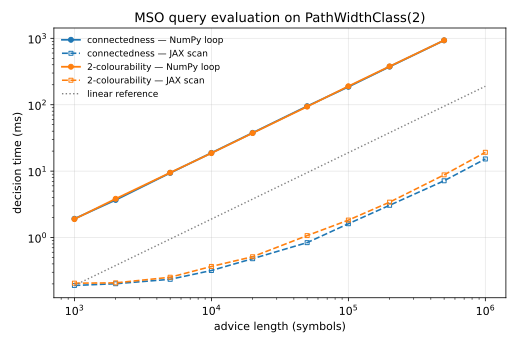
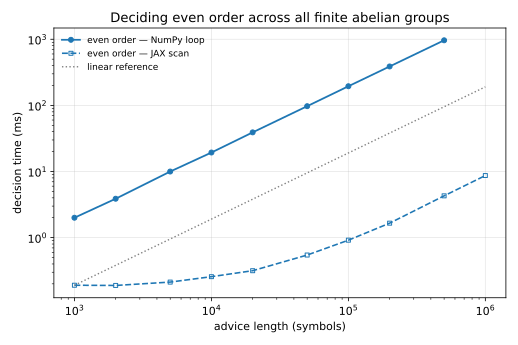
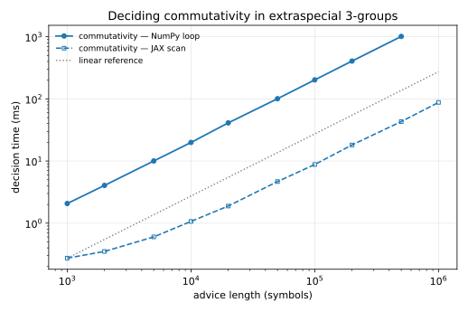

# AutStr benchmarks

These scripts exercise the core promise of a *uniformly automatic class*: a
first-order / monadic second-order query is compiled into a finite automaton
**once** for the whole class, after which deciding it on a concrete structure is
a single linear pass of the structure's advice word through that automaton —
cheap enough for structures with millions of advice symbols, and trivially
batchable. Structures are generated directly as advice words (never as networkx
or group objects), so the benchmarks scale instantly.

Every benchmark reports the same three things: **single-structure scaling**
(one huge structure, showing linear decision time), **batched throughput**
(NumPy per-structure loop vs. NumPy batch vs. JAX batch, with a ground-truth
correctness check), and a **runtime curve** (SVG + PDF) confirming linearity.

| benchmark | class | property | automaton | plot |
|-----------|-------|----------|:---------:|------|
| `uniform_graph_benchmark.py` + `runtime_curves.py` | `TreeDepthClass(4)` | connectedness, 2-col, 3-col | 11 / 16 / >6 GB | `runtime_curves.svg` |
| `pathwidth_graph_benchmark.py` | `PathWidthClass(2)` | connectedness, 2-col | 16 / 22 | `pathwidth_curves.svg` |
| `abelian_group_benchmark.py` | finite abelian groups | has an element of order 2 | 9 | `abelian_even_order_curve.svg` |
| `extraspecial_group_benchmark.py` | extraspecial p-groups | do two elements commute? | 6 | `extraspecial_commute_curve.svg` |

Common timing/throughput/plot helpers live in `_bench_common.py`.

## Tree-depth graphs (`uniform_graph_benchmark.py`, `runtime_curves.py`)

The class is `TreeDepthClass(4)` (all graphs of tree-depth ≤ 4). Graphs are
generated directly as advice words (never as networkx objects), so the
benchmarks scale to tens of millions of vertices instantly.

## Queries and the width/complexity boundary

| query | complexity (general graphs) | width | automaton | compile |
|-------|-----------------------------|:-----:|:---------:|:-------:|
| connectedness   | P            | 4 | 11 states | ~14 s, ~1.2 GB |
| 2-colourability | P            | 4 | 16 states | ~17 s, ~1.4 GB |
| 3-colourability | **NP-complete** | 5 | large     | **> 6 GB** |

The compile cost is governed by the **width** — the number of simultaneously
free variables — because the intermediate automata range over `base^width`
symbol combinations (`base = 18` for tree-depth 4). Connectedness and
2-colourability are width 4 (advice + one set + two edge endpoints) and compile
comfortably on a laptop. 3-colourability is width 5: it needs two colour-set
tapes (two bits encode three colours, forbidding `(1,1)`) plus two
edge-endpoint tapes, and that extra factor pushes the peak past 6 GB.

3-colourability is essentially the *minimal* NP-hard MSO query: a fixed formula
that is NP-hard on general graphs has to be "colouring-like", and colouring
inherently costs ⌈log₂k⌉ colour sets plus two vertices to inspect an edge. It
is also non-trivial only at tree-depth ≥ 4 — the chromatic number is bounded by
the tree-depth, so K4 (tree-depth 4) is the smallest non-3-colourable
obstruction. (On any bounded-tree-depth class, evaluating *any* fixed MSO query
is linear-time by Courcelle's theorem; "NP-hard" refers to the query's
difficulty on unrestricted graphs, which is what the automaton encodes.)

## `uniform_graph_benchmark.py` — throughput

```bash
pip install "autstr[jax,graphs]"       # jax optional but powers the batch path
python benchmarks/uniform_graph_benchmark.py --max-exp 6 --batch 50000
```

Representative results (laptop CPU, no GPU), 2-colourability:

```
== Single-graph scaling (one huge graph, NumPy) ==
     999,999 vertices   decided in 3.31 s   (0.30 Mverts/s)
  same 999,999-vertex graph via JAX scan: 22.4 ms (44.6 Mverts/s)

== Batched throughput: 50,000 graphs x 401 vertices ==
  NumPy loop :  41004.1 ms  (  0.49 Mverts/s)
  NumPy batch:   1076.0 ms  ( 18.63 Mverts/s)  speedup  38.1x
  JAX batch  :    215.9 ms  ( 92.86 Mverts/s)  speedup 189.9x
  correctness: all 50,000 match ground truth and each other
```

The decision is inherently sequential, yet JAX compiles the scan to native code
and decides a million-vertex graph in ~22 ms (~150× the Python loop).
Classifying many graphs at once is where throughput lives: batched NumPy is
~38× the per-graph loop and the JAX batch ~190×.

## `runtime_curves.py` — linear scaling

```bash
pip install "autstr[jax,benchmarks]"       # benchmarks extra pulls in matplotlib
python benchmarks/runtime_curves.py --reps 5 --max-exp 7
```

Sweeps vertex counts geometrically and times a single decision (NumPy loop up to
5·10⁵, JAX scan up to 10⁷), writing a CSV and a vector plot (`runtime_curves.svg`
and `.pdf`). It reports the per-vertex time — constant iff evaluation is linear —
and the R² of a through-the-origin linear fit.


```
=== connectedness (automaton: 11 states) ===
    vertices   numpy(ms)   ns/vert    jax(ms)   ns/vert
       1,000       1.939    1939.3      0.204    203.85
      10,000      18.654    1865.4      0.318     31.76
     100,000     190.794    1907.9      1.892     18.92
     500,000     953.221    1906.4      8.504     17.01
  10,000,000          --        --    223.320     22.33
  NumPy linear fit: 1906.8 ns/vertex, R^2 = 1.00000
  JAX   linear fit:   21.31 ns/vertex, R^2 = 0.99035
```

On log-log axes the NumPy curves sit exactly on the slope-1 reference across
three orders of magnitude (R² = 1.0000) — decision time is linear in the number
of vertices. JAX decides 10 million vertices in ~0.22 s (~20 ns/vertex); its
per-call overhead makes it only *asymptotically* linear, visible as the dashed
curves flattening below the reference for small graphs.

## Pathwidth graphs (`pathwidth_graph_benchmark.py`)

The linear-layout companion: `PathWidthClass(2)`, whose advice records a linear
layout (each vertex's register and the registers of its earlier neighbours).
Since pathwidth-2 graphs have chromatic number ≤ 3, 3-colourability is trivially
true there; the non-trivial invariants are **connectedness** (16 states) and
**2-colourability** (22 states). Both scale linearly (NumPy R² = 0.99999, ~1.87
µs/vertex) and hit ~180–190× on the JAX batch.

```bash
python benchmarks/pathwidth_graph_benchmark.py --max-exp 6 --batch 50000
```



## Finite abelian groups (`abelian_group_benchmark.py`)

The algebraic counterpart. Property: **the group has an element of order 2**
(equivalently, even order) — the group-theoretic analogue of bipartiteness, a
structural yes/no invariant one 9-state automaton decides for *every* finite
abelian group from its cyclic decomposition (LSB-first binary blocks separated
by `#`). A group with k cyclic factors has advice length ~3k, so "large" means a
decomposition into millions of factors; the group order itself (2ᵃ·3ᵇ) is
astronomically larger, yet the invariant is decided in time linear in the
advice.

```bash
python benchmarks/abelian_group_benchmark.py --max-exp 6 --batch 50000
```

```
== Batched throughput: 50,000 structures, even order ==
  50,000 structures x 600 symbols (25080 satisfy the query)
  NumPy loop :  58461.0 ms  (  0.51 Msym/s)
  NumPy batch:   1019.9 ms  ( 29.41 Msym/s)  speedup  57.3x
  JAX batch  :    279.4 ms  (107.38 Msym/s)  speedup 209.3x
```



Because the advice alphabet has only four symbols, richer queries stay cheap to
compile here than on the graph classes (whose ~18-symbol alphabets make width
the binding constraint).

## Extraspecial p-groups (`extraspecial_group_benchmark.py`)

A *multi-tape* query rather than a sentence: **do two group elements commute?**
For a fixed prime p the Heisenberg-type group of order p^(1+2n) is nilpotent of
class 2; x = (c, a, b) and y = (c', a', b') commute iff the symplectic form
⟨a, b'⟩ - ⟨a', b⟩ vanishes mod p. A single **6-state** automaton reads the
convolution of the advice (1^(n+1)) with the two element encodings and decides
this for every rank n — so it computes in groups of astronomically large order
(3^(1+2n)) in time linear in the rank.

```bash
python benchmarks/extraspecial_group_benchmark.py --max-exp 6 --batch 50000 -p 3
```

```
== Single-structure scaling (NumPy) ==
   1,000,000-symbol group (order 3^2000001) decided in 2.06 s
   same group via JAX scan: 87.7 ms
== Batched throughput: 50,000 element pairs x 201 symbols (16,600 commute) ==
  NumPy loop :  20663.2 ms  (0.49 Msym/s)
  NumPy batch:   1225.4 ms  (8.20 Msym/s)  speedup  16.9x
  JAX batch  :    377.1 ms  (26.65 Msym/s) speedup  54.8x
  NumPy linear fit: 2023.9 ns/symbol, R^2 = 1.00000
```



The multi-tape scan does more work per step (a gather over the 3-tape alphabet),
so the JAX speedup is smaller than for the single-tape sentence queries, but the
scaling is still perfectly linear.

The remaining classes suit this style less: the index-2 cyclic groups have
advice of length only ~log(order), so there is no large-structure axis to sweep.

## Compiling 3-colourability

The 3-col automaton needs more RAM than a typical laptop has (> 6 GB peak).
Build it once on a larger machine and drop the serialized file into the cache;
both scripts then run 3-col exactly like the others:

```python
from autstr.graphs import TreeDepthClass
from benchmarks.uniform_graph_benchmark import THREE_COL, CACHE
dfa, _ = TreeDepthClass(4).evaluate(THREE_COL)
dfa.sparse_dfa_to_file(str(CACHE / "3col_td4.sdfa"))
```

This is the uniform paradigm in miniature: the compile is a one-time,
machine-independent cost you can pay once and serialize; evaluating the
resulting automaton on huge graphs is always cheap.

## Caching and safely running heavy compiles

Compiled automata are serialized under `$AUTSTR_BENCH_CACHE`
(default `/tmp/autstr-bench-cache`), so only the first run pays compilation.

Query compilation can transiently allocate several GB. To cap memory without
risking the desktop session, run under a cgroup scope (Linux/systemd):

```bash
systemd-run --user --scope -p MemoryMax=6G -p MemorySwapMax=0 \
  python benchmarks/uniform_graph_benchmark.py
```

The scope is OOM-killed in isolation if it exceeds the cap. A plain `ulimit -v`
also caps the NumPy-only path but conflicts with JAX, whose XLA runtime
reserves a large virtual address space at startup.
